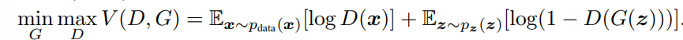
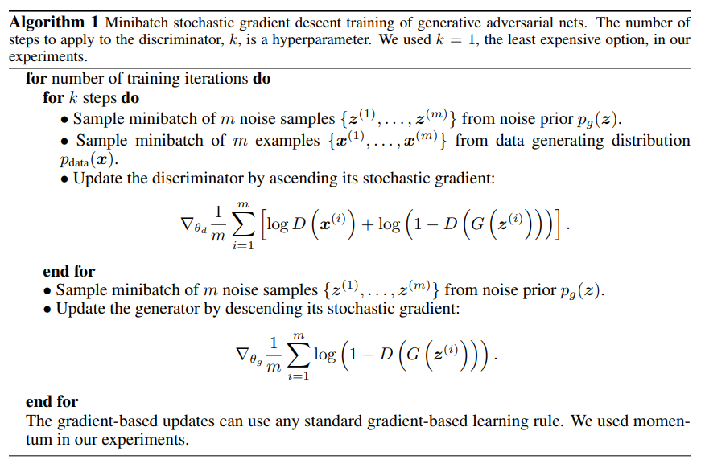

# GAN Notes

## Abstract
- A proposed proposed framework of two models. A generative model G and a discriminate model D.
- Model G captures the data distribution and model D estimates the probability of if a data sample came from training data rather generated from G.
- The purpose of G is the become good enough to deceive the model D.
- Framework is called adversarial because two models are competing with one another.

---

## Adversarial Nets
- The models G and D are both preferred to be multilayer perceptrons.
- G is represented as a differentiable function G(z), where z is input added with noise. D is a also a function D(x) where x is a sample data. Both D and G have their own respective input parameters.
- D(x) outputs a scalar representing the probaility that x came from data and not from G.
- D is maximized to correctly predict samples from actual data rather ones generated by G, whilst G has the loss funtion log(1 - D(G(z))) minimized. 
- G and D lplat a two-palyer minimax game with a value function V(D,G).
    - Equation: 
- The game in practice is implemented using an iterative, numerical approeach. Optimizing D is done in k steps, whilst G is optimized one step at a time. Keeps D near its optimal solution and slowly optimizes G.
- At the start of training, log(1 - D(G(z))) may not provide provide a great gradient for G to learn well. In early learning stage, sampled generated from G are very poor and easily rejected by D. Thus using log(D(G(z))) is maximized instead to train G, providing much stronger gradients.

---

## Algorithm 1
- 
- Simplified Algorithm: 
```
  Repeat:
    Sample real images
    Sample random noise

    Train discriminator

    Sample new random noise

    Train generator

  Repeat until convergence
  ```

---

## Experiments 
- Used MNIST, Toronto Face Database (FTD), and CIFAR-10 datasets.
- The generator nets used a mix of rectifier linear activations and simoid activations. The discriminator net used maxout activations, where dropout was applied in training the discriminator net. Noise was used as input to only the bottommost layer of the generator network.

---

## Additional Info
- The generator maps random noise z from a latent space into samples resembling the real data distribution. Different noise vectors produce different outputs, allowing the model to generate many unique samples.
- The discriminator learns the boundary between real and generated data. As training progresses, this boundary becomes harder to learn because the generator continually improves.
- As the discriminator improves, it provides better gradient information to the generator. The generator then produces more realistic samples, forcing the discriminator to improve further. Both models improve through competition.
- At the optimal solution, the generator reproduces the real data distribution and the discriminator cannot distinguish real from generated samples, predicting 0.5 for both.
