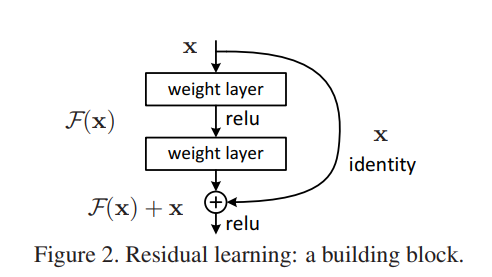
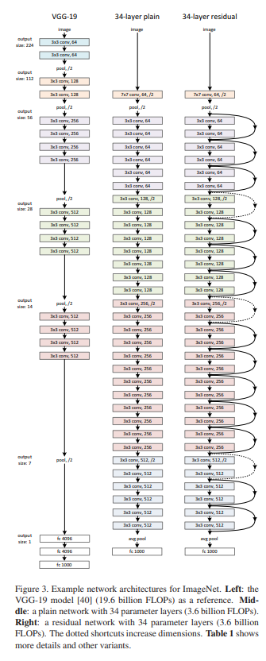

# Deep Residual Learning for Image Recognition Notes

## Abstract
- Deeper neural networks are har to train, authors of paper present an easier way to train them that are **substantially deeper** than other attempts before.
- Use explicit reformilation of the layers of network as learning residual functions with reference to the the layer inputs, (I guess previous attempts had were learning unreferenced functions).
- Due to these residual functions they are able to traing networks with very large amount of layers and keep both complexity & training time to a minimum.

## Figures
- 
    -  Residual learning: a building block.
- 
    - Comparing architectures of different models to the ResNet.

## Section 3: Deep Residual Learning (Architecture)
- 3.1 (Residual Learnig):
    - Basically the residual function is the different between the output of a coouple layers and the orignal input. Mathematically: let H(x) be a mapping from x to an output same dimensionality of x, F(x) = H(x) - x, where F(x) is the residual function. Thus H(x) = F(x) + x.
    - Using identity maps for layers to leverage a very small trainning error, with the condition that the identity maps are optimal
- 3.2 (Identity Mapping by Shortcuts):
    - y = F(x, {W_i}) + x, definfition of a building block and residual learning is applied to every few stacked layers.
        - x is the input vector, y the output, ad F(x, {W_i}) represents the residual mappings to be learned.
    - Usually F is more than one layer (like 2 or 3), where when case of 1, there no noticable improvement.
- 3.3 (Network Architectures):
    - Comapred to the VGG-19 with noticably fewer (multiply-adds). In the experiment shown in figure 3, the 34-layer baseline plain model has 3.6 billion FLOPs to VGG-19 had 19.6 billion.
    - Then to transform the model from being plain to residual network is by inserting identity shortcut connections every few layers using the residual formula, but if y and x differ use 1x1 convolution.
- 3.3 (Implementation):
    - Complete excerpt: "Our implementation for ImageNet follows the practice in [21, 40]. The image is resized with its shorter side randomly sampled in [256, 480] for scale augmentation [40]. A 224×224 crop is randomly sampled from an image or its horizontal flip, with the per-pixel mean subtracted [21]. The standard color augmentation in [21] is used. We adopt batch normalization (BN) [16] right after each convolution and before activation, following [16]. We initialize the weights as in [12] and train all plain/residual nets from scratch. We use SGD with a mini-batch size of 256. The learning rate starts from 0.1 and is divided by 10 when the error plateaus, and the models are trained for up to 60 × 104 iterations. We use a weight decay of 0.0001 and a momentum of 0.9. We do not use dropout [13], following the practice in [16]. In testing, for comparison studies we adopt the standard 10-crop testing [21]. For best results, we adopt the fully convolutional form as in [40, 12], and average the scores at multiple scales (images are resized such that the shorter side is in {224, 256, 384, 480, 640})."

## Section 4 (Experiments):


## Insights
1. Residuals help where gradients can flow thorugh many layers and not vanish/explode through man layers. This is why 50, 100, 152 layers are possible.
2. Basic block:
    - ```
        x
        │
        ├── Conv → BN → ReLU → Conv → BN ──┐
        │                                  │
        └────────────── identity ───────────┘
                        ↓
                        Add
                        ↓
                        ReLU
     ```

---

## Questions
1. What is does it mean to learn unreferenced/referenced functions in this context?
    - Answer: unreferenced learning is when a mapping layer learns without a hint, whilst the referenced layers in residual networks have the hint of the residual to help them learn.
2. What does FLOPs mean in terms of model architecture, probably learnable parameters?
    - Answer: FLOPs(floating-pint operations) as described in paper is (multiply-adds), thus the amount of total computation done in a model for I would be believe is one forward pass through the model. Essentially, they help compute the cost of the model.
3. What is the degradation problem?
    - Answer: When deeper networks statrt to converge, the network depths increases and accuracy gets saturated. Then degrades rapidly. In other words, adding more layers causes the network to perform worse.
    - Addtional info: This happens even when overfitting is NOT the issue and it's an optimization problem, not just generalization.
4. What does saturated training accuracy mean?
    - Answer: When a training accuracy seems to no longer make meaningful improvements with every epoch.
