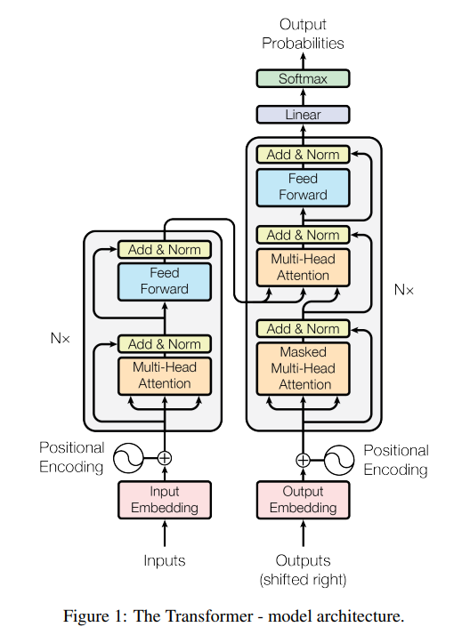
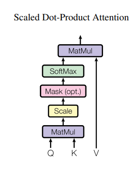
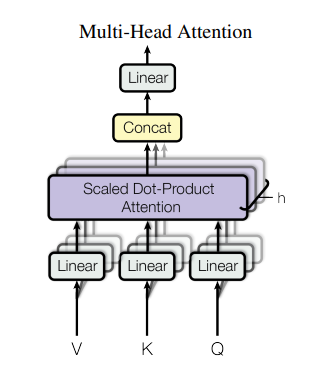
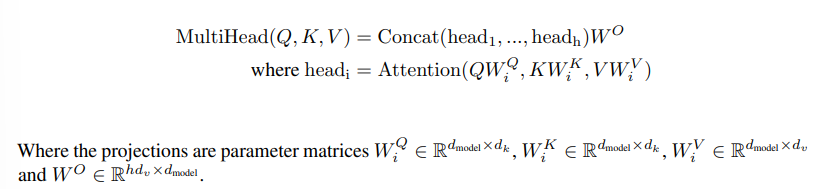
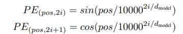

# Transformer Notes
Link to paper: [Attention Is All You Need](https://proceedings.neurips.cc/paper_files/paper/2017/file/3f5ee243547dee91fbd053c1c4a845aa-Paper.pdf)

## Abstract
- Best performing models connect an encoder and decoder through an attention mechanism. 
- The transformer focuses and the attention aspect with reccurences and convolutions entirely. 
- Improved on training time and parallizability in terms of model complexity. Task in question id translation from English to French.

---

## Introduction
- RNNs were the amongs the best for language modeling and machine translation.
- The Transformer focuses on the combination of reccurence and attention mechanisms, then strictly relying on attention.
- Due to nature of RNNs using reccurence, it makes it harder to make training these models paralleziable. Relys on approaches like factorization tricks and conditional computation.

---

## Figure 1

---

## Model Architecture
At the time neural sequence transuction models had encoder-decoder structure.

### Encode and Decoder Stacks
- Encoder: Builds contextual representations of the input sequence.
    - The encoder is composed of a stack of N =6 identical layers. For each layer thre are two sub-layers. The first sub-layer is a mutli-head self-attention mechanism, and second is a simple fully connected feed-forward network. There are residual connections around each of the two sub-layers foled by a layer of normalization.
    - This can be exemplified in the this function: LayerNorm(x + Sublayer(x)).
    - To facilitate the residual conections all sub-layers and embedding layers produce outputs of dimension 512.

- Decoder: Generates the output sequence one token at a time while attending to both previous outputs and the encoder representations.
    - Decoder is also comprised of N = 6, identical layers. It has 3 sub-layers, where the additional layer performs a multi-head attention over the output of the encoder stack. 
    - Like the encoder there are residual connections and a normalization layer.
    - The self-attention sub-layer is modified to prevent positions from attending subsequent positions. This is a kind of masking with the addition of output embeddings are off by one position, ensures that predicstions for position i can only depend on known outputs at positons less than i. During training, the decoder has access to the full target sentence. The mask prevents it from looking ahead, so it learns to generate one token at a time just as it will during inference.

### Attention
Attention is a function. It is mapping from a query and a set of key-value pairs to an output. The query, keys, values, and output are all vectors. The output is computed as a weighted sum of the values, where the wieght assigned to each value is computed by a compatability function of the query with corresponding key. 

A word is converted into into three distinct vectors Query (Q), Key (K), and Value (V).
- Exlpaing the inputs: 
    - Query (Q): What the current word is looking for in the rest of the sequence.
    - Key (K): What information each word offers for matching against a query.
    - Value (V): The information that will be passed along if that word is attended to.

For each word, its Query is compared with the Keys of every word in the sequence to compute compatibility scores. These scores are scaled and passed through a softmax to produce attention weights. The attention weights are then used to compute a weighted sum of the corresponding Values, producing a context-aware representation of the current word.

- Scaled Dot-Product Attention:
    - The attention of this model is called the "Scaled Dot-Oriduct Attention"
    - The input consists of queries and keys of dimension d_k and values of dimension d_v. The dot product of the keys and the queries then scaled by dividing by sqrt(d_k), then applying a softmax function to obtain the weights on the values. 
    - In practice computing the attention function on a set of queries simultaneously, packed together into a matrix Q. The keys and values are also packed into a matrix K and V respectively. This can be seen in this equation: Attention(Q,K,V) = softmax(QK^T/sqrt(d_k))*V.
    - Dot-product attention is much faster then additve attention since matrix multiplication code is much faster, with the scaling of 1/sqrt(d_k).
    - Visualization of the dot-product: 

- Multi-Head Attention:
    - Instead having one attention function, using a mutliheaded one incoprates a paralleized attention that does multiple attention computations at once where the results of each one is concatnated into one result. Different heads can learn different relationships between tokens (for example, nearby context versus long-range dependencies).
    - Visualization and equation: 
    

- Embeddings and Softmax:
    - Like sequence transduction models, the transformer uses learned embeddings to convert the input and output tokens to dimesion d_model.

---

## Positional Encoding
- Since self-attention has no notion of order, positional encodings are added to token embeddings so the model knows where each token appears in the sequence.
- Positional encodings are added to the bottom of the encoder and decoder stacks. The encodings and embeddings have same dimension so they can simply be added.
- For the encodings sine, cosine, and a learned encodings were used, but found that the sinusodial ones were able to extrapole to sequences of longer length better.
    - The sinusodal equations can be seen here: 

## Conclusion
- The Transformer is the first sequence transduction model based entirely on attention, replacing recurrent layers with multi-head self attention.

---
## Additional Notes

### Learned Terminology
- Transduction Problems: Where machine learning models predict unlabeled data from learning from labeled training data.

---

## Answering Questions without looking back on paper.
- Why did the Transformer replace recurrence with attention?: The multi-head attention is much more paralizeable
- What are Queries, Keys, and Values?: Inputs for the attention function,
- Why is positional encoding necessary?: I still don't know
- What is the difference between encoder self-attention and decoder self-attention?: There is an additional sub-layer within the N=6 layers, that does maske multi-head attention. Also, encoder self-attention means every token can attend to every other input token, whilst decoder self-attention means each token can only attend to itself and earlier tokens because future tokens are masked.
- What is masked attention, and why is it used?: ensures the model isn't cheating by looking ahead at other tokens.
- What modules will you need to implement in PyTorch?: softmax, linear module, sequential blocks, normalization, etc.